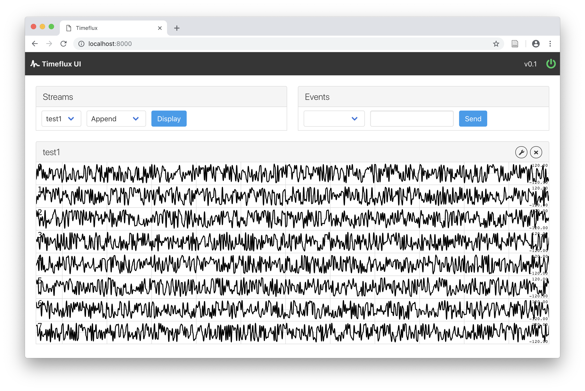

# Timeflux UI

This plugin provides a framework to develop web applications that can interface with Timeflux. A monitoring web interface is bundled. It is not feature-complete yet, but it already allows you to visualize your data streams in real-time, in your browser, and to send events. Other examples include a SSVEP scheduler and a P300 speller. Both can be found in the ``apps`` directory.

## Installation

First, make sure that [Timeflux is installed](https://github.com/timeflux/timeflux).

You can then install this plugin in the ``timeflux`` environment:

```
$ conda activate timeflux
$ pip install git+https://github.com/timeflux/timeflux_ui
```

## Screenshot



## Performances

Right now, the time series are displayed in the main thread using the HTML canvas element. On large screens or with high sample rates, performances will degrade significatively. This issue has been adressed with the [SensorChart](https://github.com/mesca/sensorchart) library and WebGL, but this has not been integrated yet. Meanwhile, we advise to downsample your data before sending it to the UI.
